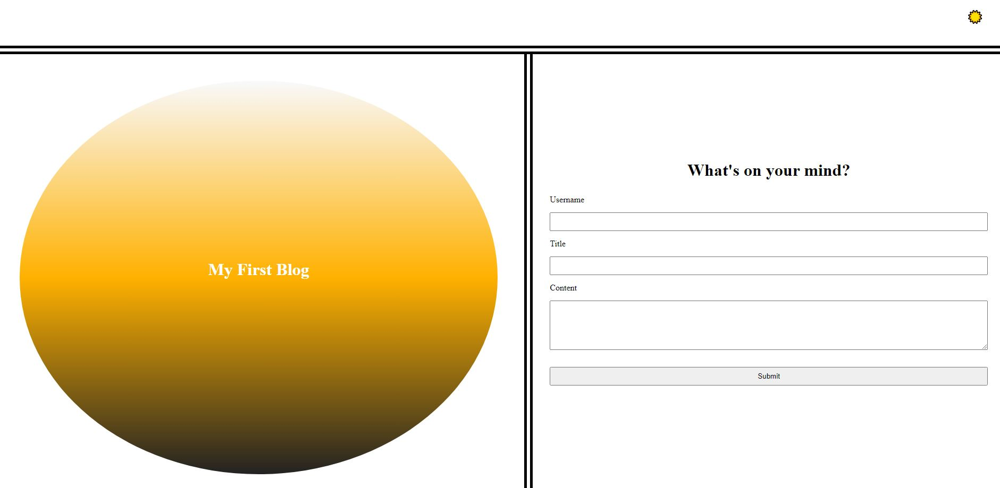
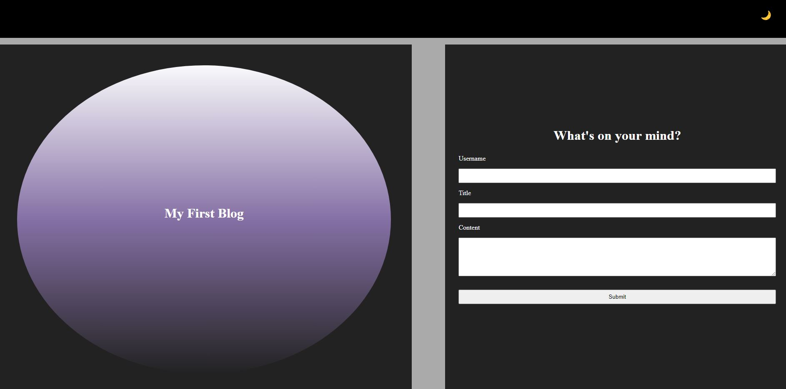
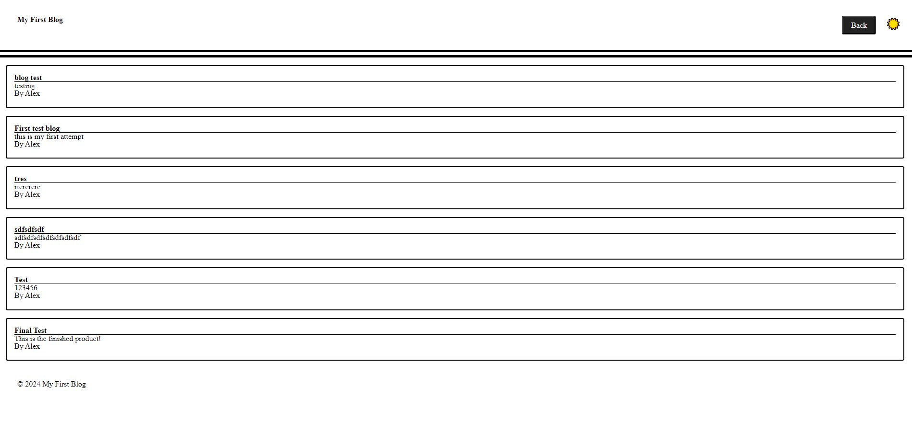
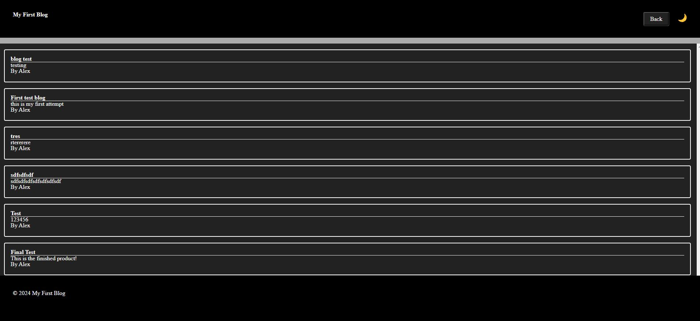

# My First Blog

My First Blog is a simple web application that allows users to write, store, and display blog posts. The application also features a light and dark mode toggle for improved readability.

## Features

- **Write and Store Blogs**: Users can create and save blog posts to local storage.
- **Display Blogs**: Blog posts are displayed on the main page.
- **Dark Mode Toggle**: Switch between light and dark themes for a better reading experience.

## Installation

1. Clone the repository to your local machine:
    ```sh
    git clone https://github.com/AlexCapilla/personal-blog.git
    ```

2. Navigate to the project directory:
    ```sh
    cd my-first-blog
    ```

3. Open `index.html` in your preferred web browser:
    ```sh
    open index.html
    ```

## Usage

### Writing a Blog Post

1. Open the application in your web browser.
2. Navigate to the blog creation page.
3. Enter the title, content, and your username.
4. Save the blog post, which will be stored in the browser's local storage.

### Viewing Blog Posts

- The main page of the application will display a list of all stored blog posts.
- If there are no blog posts, a message will indicate that no blogs are available.

### Toggling Light and Dark Mode

- Use the toggle button in the navigation bar to switch between light and dark modes.
- The selected mode will be saved in local storage and applied on subsequent visits.

## Screenshots
 - Main Page Light

 - Main Page Dark

 - Blog Page Light

 - Blog Page Dark


## Contributing

Contributions are welcome! If you have any ideas for improvements or new features, feel free to open an issue or submit a pull request!

## License

This project is licensed under the MIT License


Copyright (c) [2024] [Alejandro Capilla]
